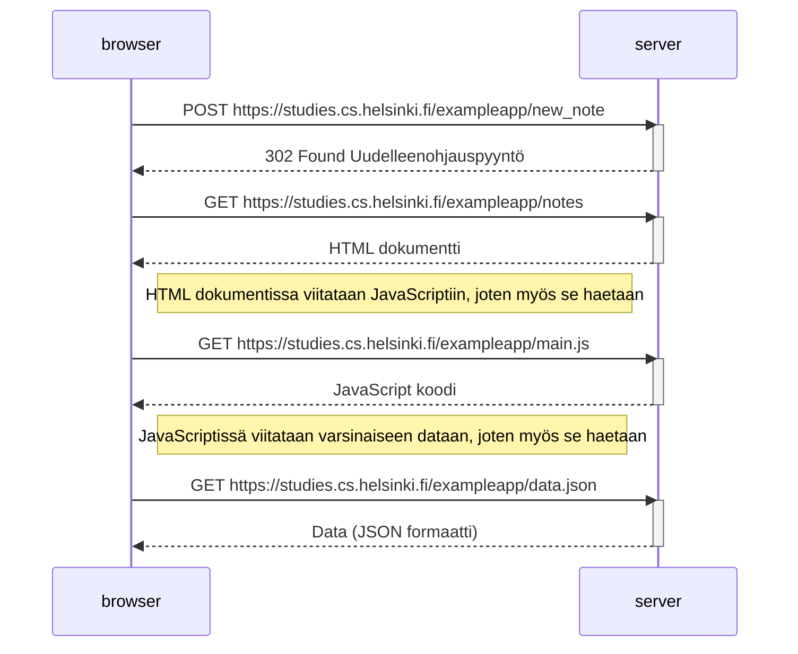

```mermaid
sequenceDiagram
    participant browser
    participant server

browser->>server: POST https://studies.cs.helsinki.fi/exampleapp/new_note
activate server
server-->>browser: 302 Found Uudelleenohjauspyyntö
deactivate server

browser->>server: GET https://studies.cs.helsinki.fi/exampleapp/notes
activate server
server-->>browser: HTML dokumentti
deactivate server
Note right of browser: HTML dokumentissa viitataan JavaScriptiin, joten myös se haetaan

browser->>server: GET https://studies.cs.helsinki.fi/exampleapp/main.js
activate server
server-->>browser: JavaScript koodi
deactivate server
Note right of browser: JavaScriptissä viitataan varsinaiseen dataan, joten myös se haetaan

browser->>server: GET https://studies.cs.helsinki.fi/exampleapp/data.json
activate server
server-->>browser: Data (JSON formaatti)
deactivate server
```
