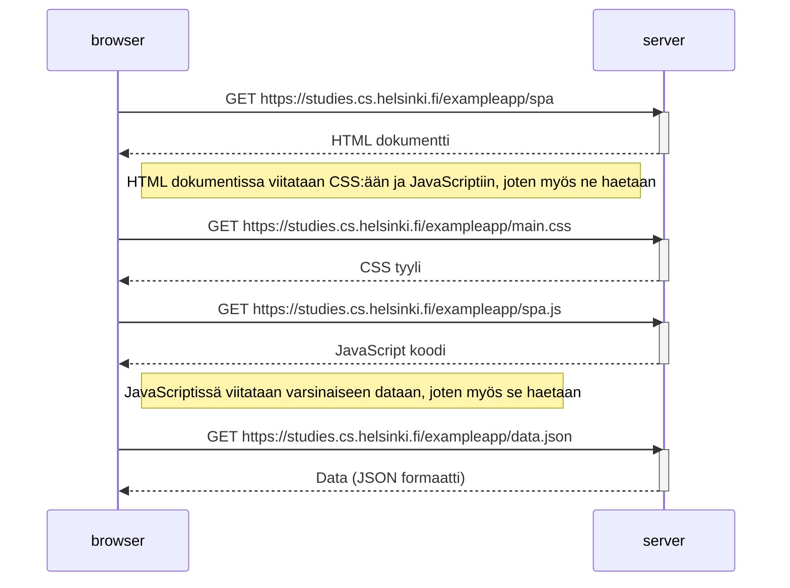

```mermaid
sequenceDiagram
    participant browser
    participant server

browser->>server: GET https://studies.cs.helsinki.fi/exampleapp/spa
activate server
server-->>browser: HTML dokumentti
deactivate server
Note right of browser: HTML dokumentissa viitataan CSS:ään ja JavaScriptiin, joten myös ne haetaan

browser->>server: GET https://studies.cs.helsinki.fi/exampleapp/main.css
activate server
server-->>browser: CSS tyyli
deactivate server

browser->>server: GET https://studies.cs.helsinki.fi/exampleapp/spa.js
activate server
server-->>browser: JavaScript koodi
deactivate server
Note right of browser: JavaScriptissä viitataan varsinaiseen dataan, joten myös se haetaan

browser->>server: GET https://studies.cs.helsinki.fi/exampleapp/data.json
activate server
server-->>browser: Data (JSON formaatti)
deactivate server
```
